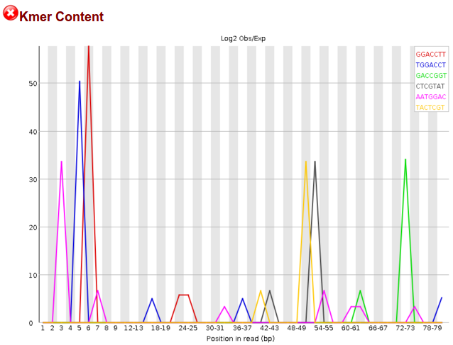
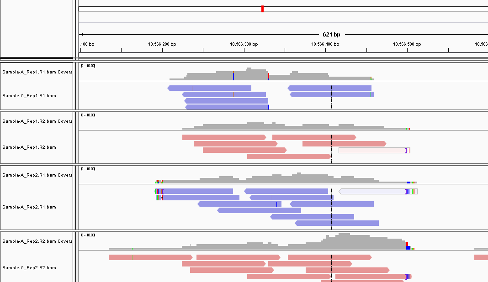
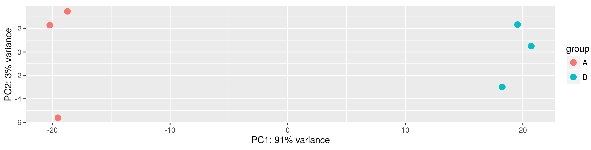
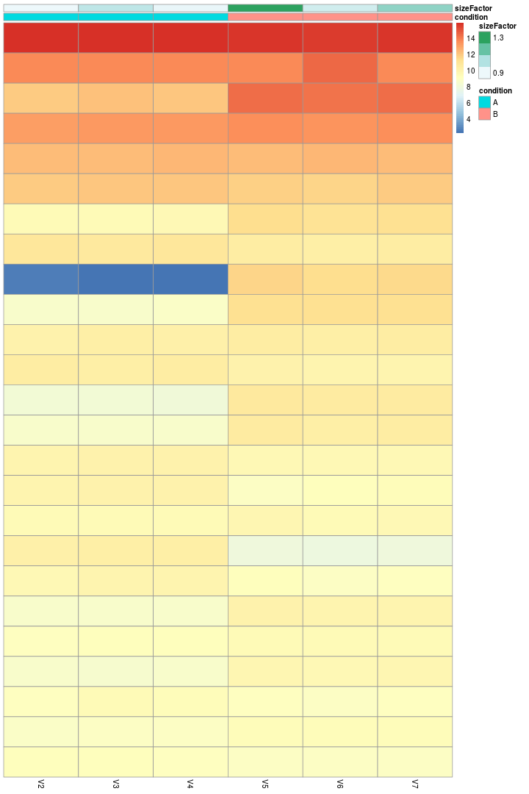

# Material Suplementario
Francisco Javier Falcon Chavez  
April 20, 2016  

 

Figura S1- Presencia de kmers debido a spike ins
    

  

Figura S2- Alineamiento de reads al genoma para determinar su orienta

    

  

Figura S3- Visualización de los dos primeros componentes principales de los datos
    

  

Figura S4- Heatmap representando a los 25 genes con la mayor media de cuentas en ambas muestras.
